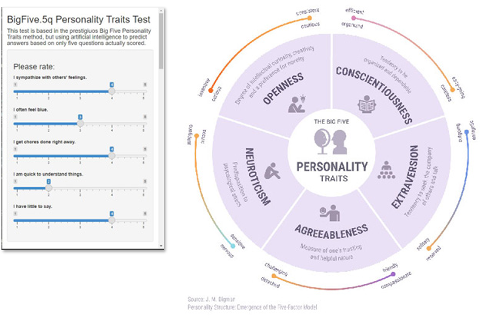
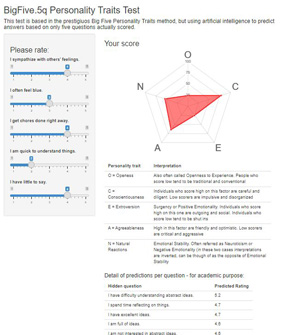

```{r setup, include=FALSE}
knitr::opts_chunk$set(
	echo = TRUE,
	error = TRUE,
	warning = FALSE
)
```


# 1 Executive Summary

This project uses prediction techniques to simplify the results obtention for the well-known "Big Five" personality traits determination test. The goal is to reduce as much as possible the input from a given user so we can predict final score as accuratedly as possible. Thus, less length, effort and time of test resolution wil probably make it easier to be integrated in other processes where estimation of personality characteristics of an individual can be useful.

This test is made of 50 questions grouped in five *personality traits*. All questions must be answered from 1 (Strongly Disagree) to 5 (Strongly Agree), being some of them "reverted" (formulated as negative). The percentile of the average of each 10-questions group is the final score for that trait. Our **goal is to use only five questions to predict all 45 others and therefore final scores for each trait**, benefiting therefore of such a very light approach to get results.

**Measurement of the accuracy** of the model will require to define and calculate indicators of how good the model works in predicting the right trait score for an individual. The fact result is a set of five numbers "percentiles" will make us define metrics for assessing how close predictions are to real results.

There are some clear **premises we will follow for this project**:

* Measurable: Strict measurement of results, based on a clear definition of the accuracy obtained.
* Usuful: Prepare model to be usuful for further developments/integrations, i.e. make it as a *pluggable module* to be integrated in other systems. For example, instead of showing always "optimal" questions to be answered, we prefer to make them -partially- random, so a deployment at bigger scale might benefit of variability.
* Indepentent validation: Never use validation (test) data partition to estimate parameters of select any criteria during training process
* Computability: project must be deep in calculation but affordable within a local environment in terms of performance. This means that we will reduce our dataset during some stages, but a wider execution can be always an option without need of changing source code, just the parameter.

There are several **original aspects** on this project:

* Use Recommender: To take advantage of a standard "recommendation model", adapting some concepts to use classical "User x Item" as inspiration for a "User x Question/Trait" structure. The advantage is to use strong prediction tool (i.e. Recommenderlab, etc.), but on the other side fact like the lack of matrix sparcicity or the very "vertical" shape of the ratings matrix (approx. 10^6 users x only 50 columns) require specific attention during the model implementation.
* An app to play: To create an interactive, open access, graphical app tool to facilitate understanding of the concept and even disclosing some of the key prediction steps followed.
* Questions selection: Our own algorithm to optimize selection of questions to get answer for, so the change (to ensure varibility on data retrieval), whilst optizing combiantion so final accuracy is best.


The Big Five personality traits, also known as the five-factor model (FFM) and the OCEAN model, is a taxonomy, or grouping, for personality traits. When factor analysis (a statistical technique) is applied to personality survey data, some words used to describe aspects of personality are often applied to the same person. For example, someone described as conscientious is more likely to be described as "always prepared" rather than "messy".




This theory is based therefore on the association between words but not on neuropsychological experiments. This theory uses descriptors of common language and therefore suggests five broad dimensions commonly used to describe the human personality and psyche.


\pagebreak
# 2 Exploratory Data Analysis

This project is based in the "Big Five Personality Test. 1M Answers to 50 personality items, and technical information" dataset. These data were collected (2016-2018) through an interactive on-line personality test and it contains:

* 1015341 records (tests).
* 110 columns of data, 50 of them answers (1=Strongly Disagree, 3=Neutral, 5=Strongly Agree) of test questions, and all others containing country, location, load date and load/response time for each question.
* A codebook detailing literal wording of each one of the 50 questions.

The personality test was constructed with the "Big-Five Factor Markers" from the International Personality Item Pool (https://ipip.ori.org/newBigFive5broadKey.htm). Participants were informed that their responses would be recorded and used for research at the beginning of the test, and asked to confirm their consent at the end of the test.

For our approach to the model we will discard country, location, and load/response time to questions, so we focus directly on the questions and their answers. As we will remark in the Conclusions chapter, there are interesting possibilities for developing the project using these data, but they are out of the scope of this project. This reduction in the number of prescriptors will significantly reduce the size of our dataset.

## Data load strategy

Data are located in Kaggle site (https://www.kaggle.com/tunguz/big-five-personality-test/download). Data size in .CSV is 396 MB, so we will, as a previous step, load, select and convert them to .rds, so a very significant size reduction is obtained to 21 MB full dataset. The code to connect directly to Kaggle server requires an API and some specific coding, so for simplification, we have previously downloaded data locally and saved to a .rds file in directory ./data-source. Code to perform this preprocess and storage is available:

```{r block_1a, eval=FALSE, echo=TRUE, message=FALSE, warning=FALSE}
# Read Kaggle dataset copied to local directory
#
# Answers to test data
# tab delimited, and  our int columns are character, perhaps because of the nulls!
df <- read.csv("./data_source/data-final.csv", sep="\t", stringsAsFactors = FALSE, na.strings=c("NA","NaN", " ", "NULL"))
# We select relevant columns to use
df <- df %>% select(c(1:50), dateload, country) %>% rownames_to_column('userId') %>%
  mutate(Month = month(dateload), Year = year(dateload)) %>%
  select(-dateload)
# Remove rows containing any NA
df <- na.omit(df)
# Remove any value not between 1 and 5 in the answers columns
df <- df %>% filter_at(vars(2:51), all_vars((.) %in% c(1:5)))
#
# Let's also load up the questions from the data dictionary
dictionary <-
  read_table("./data_source/codebook.txt", skip=5) %>%
  separate(1, sep="\t", extra="merge", into=c("ID", "Question")) %>%
  data.frame() %>% top_n(50)

##########################################################
# Save .RDS input data to local files
##########################################################
saveRDS(df, "./data_source/BFtests.rds")
saveRDS(dictionary, "./data_source/dictionary.rds")
```

However, it is not necessary to run the this preload to run project, since all two referred input datasets are already, and publicly, available:

./data-source/BFdata.rds

./data-source/dictionary.rds


```{r block_1, eval=FALSE, message=FALSE, warning=FALSE, include=FALSE}
################################################################################
# BigFive.5q Project
# A model to predict 45 questions based in only 5 answered
# Author: Juan Eloy Suarez
################################################################################


## =============================================================================
## =============================================================================
## Initialize environment
## =============================================================================
## =============================================================================
#
if(!require(tidyverse)) install.packages("tidyverse", repos = "http://cran.us.r-project.org")
if(!require(lubridate)) install.packages("lubridate", repos = "http://cran.us.r-project.org")
if(!require(gtools)) install.packages("gtools", repos = "http://cran.us.r-project.org")
if(!require(psych)) install.packages("psych", repos = "http://cran.us.r-project.org")
if(!require(recommenderlab)) install.packages("recommenderlab", repos = "http://cran.us.r-project.org")
if(!require(caret)) install.packages("caret", repos = "http://cran.us.r-project.org")
if(!require(corrplot)) install.packages("corrplot", repos = "http://cran.us.r-project.org")
if(!require(extraDistr)) install.packages("extraDistr", repos = "http://cran.us.r-project.org")
if(!require(tinytex)) tinytex::install_tinytex()  # For RMarkdown .PDF generation

library(tidyverse)
library(patchwork)
library(lubridate)
library(ggrepel)
library(ggplot2)
library(patchwork)
library(ggthemes)
library(gridExtra)
library(caret)
library(corrplot)
library(extraDistr)

library(recommenderlab)
library(psych)
library(gtools)
library(matrixStats)

options(digits=5)

Sys.setlocale("LC_TIME", "english")


## =============================================================================
## =============================================================================
## Load dataset
## =============================================================================
## =============================================================================
#
##########################################################
# Reading input data files 
##########################################################
# 
# Data are available in RDS format in directory ./data_source after being loaded by previous code ./load_data.R. This R native format allows a very significant reduction in input data size
df <- readRDS("./data_source/BFtests.rds")
dictionary <- readRDS("./data_source/dictionary.rds")
head(df)
dictionary
```


## Distribution of scores per trait

We will refer as *Scores* to the result (in percentile) of the average of answers (1 to 5 as possible values) corresponding to the ten questions forming each trait. This must be done considering that part of the questions are formualted "reverted" according to published test definition. 


```{r block_2, eval=FALSE, message=FALSE, warning=FALSE, include=FALSE}
# This list identifies each column to its corresponding group and informs of the sign (to revert if necessary) based in our previous analysis of correlation
keys.list <- list(openess = c("OPN1","-OPN2","OPN3","-OPN4","OPN5","-OPN6","OPN7","OPN8","OPN9","OPN10"), 
                  conscienciousness = c("CSN1","-CSN2","CSN3","-CSN4","CSN5","-CSN6","CSN7","-CSN8","CSN9","CSN10"), 
                  extroversion = c("EXT1","-EXT2","EXT3","-EXT4","EXT5", "-EXT6", "EXT7", "-EXT8", "EXT9", "-EXT10"), 
                  agreeability = c("-AGR1", "AGR2", "-AGR3", "AGR4", "-AGR5", "AGR6", "-AGR7", "AGR8", "AGR9", "AGR10"), 
                  natural_reactions = c("EST1","-EST2","EST3","-EST4","EST5", "EST6", "EST7", "EST8", "EST9", "EST10"))

```

Since this type of scoring is very frequent in psychometrics, we will take advantage of the package **psych**. Its function **scoreItems** will directly calculate scores (i.e. mean per group taking sign into account). Detailed documentation on this function can be found: See: https://www.rdocumentation.org/packages/psych/versions/2.1.3/topics/scoreItems

```{r block_2a, eval=FALSE, message=FALSE, warning=FALSE, include=FALSE}
scoresfile <- scoreFast(keys.list, df) #scoresfile <- scoreVeryFast(keys.list, df)
# Add calculated columns (scores)
df_scored_preReversion <- cbind(df, scoresfile)
# Once obtained the observation average per group, we need the p-value (0 to 100) per observation in group scope
P1 = ecdf(scoresfile[,1])    # P is a function giving the empirical CDF of X
P2 = ecdf(scoresfile[,2])
P3 = ecdf(scoresfile[,3])
P4 = ecdf(scoresfile[,4])
P5 = ecdf(scoresfile[,5])
# Store a rounded percentage (percentile) as resulting score for each trait
df_scored_preReversion <- df_scored_preReversion %>% mutate(
  `openess-P` = round(P1(`openess-A`)*100), 
  `conscienciousness-P` = round(P2(`conscienciousness-A`)*100), 
  `extroversion-P` = round(P3(`extroversion-A`)*100), 
  `agreeability-P` = round(P4(`agreeability-A`)*100), 
  `natural_reactions-P` = round(P5(`natural_reactions-A`)*100) )

```

We now visualize how some of the traits tend to be valuated higher than others. For a global analysis, a normalization should we adequate, but we are now focusing in individual study of questions & traits, so the most significant interpretation is that each one of them is approxmimately normal, which be usuful later for percentile calculations.

```{r block_2b, eval=FALSE, message=FALSE, warning=FALSE, include=FALSE}
# We take a look at the different indexes against each other, to see what sort of interrelationships they might have.
df_scored_preReversion %>% ggplot() +
  theme_bw() +
  geom_density(aes(x=`extroversion-A`, fill = "Extroversion"), alpha=.2)+
  geom_density(aes(x=`natural_reactions-A`, fill = "Natural Reactions"), alpha = .2)+
  geom_density(aes(x=`agreeability-A`, fill = "Agreeability"), alpha = .2)+
  geom_density(aes(x=`conscienciousness-A`, fill = "Concienciousness"), alpha = .2)+
  geom_density(aes(x=`openess-A`, fill = "Openess"), alpha = .2)+
  labs(title="Distributions of Scores", x="Response Score")
```


## Test Reliability in each personality trait (internal consistency)

We are now interested in assessing the internal consistency of the test, i.e. to know at what extent our questions are related, behave similarly, when they belong to same group/trait.

The Cronbach’s alpha coefficient measures reliability, or internal consistency, to see if multiple-question Likert scale surveys are reliable. Cronbach’s alpha will tell us how closely related a set of test items are as a group. More details on Cronback's alpha can be found here: https://www.rdocumentation.org/packages/psych/versions/2.1.3/topics/alpha

According to this coefficient generalized interpretation, values of alpha between 0.8 and 0.9 are considered "Good Internal Consistency", while alpha greater than 0.9 means an "Excellent Internal consistency" situation.

```{r block_3, eval=FALSE, message=FALSE, warning=FALSE, include=FALSE}
# Preparation, questions structure
# To prepare an analysis per "traits" (each one includes groups of questions), we create a list of 5 concepts (groups of questions per personality dimension)
extroversion = dictionary[c(1:10), "ID"]
natural_reactions = dictionary[c(11:20), "ID"]
agreeability = dictionary[c(21:30), "ID"]
conscienciousness = dictionary[c(31:40), "ID"]
openess = dictionary[c(41:50), "ID"]
buckets = list("extroversion" = extroversion,
               "natural_reactions" = natural_reactions,
               "agreeability" = agreeability,
               "conscienciousness" = conscienciousness,
               "openess"= openess)
# Groups analysis
# For each concept, let's calculate alfa to check "internal consistency" of its questions
# The result also identify which variables should be inverted (negative correlation)
questionsSigns <- numeric()
traitsAlphas <- data.frame()
for(i in 1:length(buckets)){
  questiondf <- df[, colnames(df) %in% unlist(buckets[i])]
  cronbach <- psych::alpha(questiondf, check.keys=TRUE)
  questionsSigns <- c(questionsSigns, cronbach$keys)
  traitsAlphas <- rbind(traitsAlphas, cronbach$total[,1:3])
}

# Reverted questions: signs indicating if questions correlate directly or "reverted"
questionsSigns

# Cronbach's alpha per trait's questions
rownames(traitsAlphas) <- NULL
```

We easily visualize that, despite of some differences among traits, all of them fall in an, at least, "high integrity" interval:

```{r block_3a, eval=FALSE, message=FALSE, warning=FALSE, include=FALSE}
# Assign question's group
traitsAlphas <- cbind(Group = paste("Questions_", seq(1,5,1), "X", sep=""), traitsAlphas)
tmpAvg <- mean(traitsAlphas$raw_alpha)
traitsAlphas %>%
  ggplot(aes(Group, raw_alpha)) +
  geom_point(color="blue") +
  geom_hline(yintercept=0.8, linetype="dashed", color = "green", size=2) +
  geom_hline(yintercept=0.9, linetype="dashed", color = "green", size=2) +
  geom_hline(yintercept=tmpAvg, linetype="dashed", color = "gray", size=1) +
  geom_label_repel(aes(label = Group),
                   label.size = NA,
                   fill = "transparent",
                   box.padding   = 0.65,
                   point.padding = 0.5,
                   segment.color = 'grey50') +
  ggtitle("Tests Reliability") +
  xlab(element_blank()) +
  ylab("Cronbach's alpha") +
  theme(legend.position = "none",
        panel.grid = element_blank(),
        axis.text.x = element_blank(),
        axis.text.y = element_text(color="blue", size=14, face="bold"))
```


## Correlation of the answers to questions

A key aspect for understanding how some questions relate to other, even belong to a different group, is their correlation. It is intuitive to think in correlation of questions as a clear indicator of how unknown values (unanswered question) can be predicted based in known answers to other questions that usually correlate.

So, let's calculate correlation matrix among all questions to visualize global data pattern. Thus, we have also a have a good source for further calculations on what questions must be chosen to answers when there is a possibility to do it. Note some questions are reverted, but this is not relevant for this exploratory analysis, since it affects only to the sign of the correlation, not its absolute value.

```{r block_4a, eval=FALSE, message=FALSE, warning=FALSE, include=FALSE}
# Correlation calculation. Calculate global correlation matrix to see full landscape instead of just per trait
corAllQuestions <- cor(df[,2:51])
# Sample of values (two per trait)
head(corAllQuestions[,c(1:2,11:12,21:22,31:32,41:42)])
# Significance calculation. This function calculates de significance test associated to the corrrelation matrix
cor.mtest <- function(mat, ...) {
  mat <- as.matrix(mat)
  n <- ncol(mat)
  p.mat<- matrix(NA, n, n)
  diag(p.mat) <- 0
  for (i in 1:(n - 1)) {
    for (j in (i + 1):n) {
      tmp <- cor.test(mat[, i], mat[, j], ...)
      p.mat[i, j] <- p.mat[j, i] <- tmp$p.value
    }
  }
  colnames(p.mat) <- rownames(p.mat) <- colnames(mat)
  p.mat
}
p.mat <- cor.mtest(corAllQuestions)  # significance test
```


Correlation within same group: Questions explicitly associated to each "trait" strongly correlate, i.e. all of them are related because all of them explain the final value of the score for its specific group (trait). We see different traits (groups). Correlation is clearly high within same group.


```{r block_4b, eval=FALSE, message=FALSE, warning=FALSE, include=FALSE}
corrplot(corAllQuestions[1:10,1:10], 
         method = "circle", 
         type = "upper", 
         order = "alphabet", 
         tl.col = "black", tl.srt = 90, 
         title =  "Trait: Openess", 
         p.mat = p.mat, sig.level = 0.01
)
corrplot(corAllQuestions[11:20,11:20], 
         method = "circle", 
         type = "upper", 
         order = "alphabet", 
         tl.col = "black", tl.srt = 90, 
         title =  "Trait: Openess", 
         p.mat = p.mat, sig.level = 0.01
)
corrplot(corAllQuestions[21:30,21:30], 
         method = "circle", 
         type = "upper", 
         order = "alphabet", 
         tl.col = "black", tl.srt = 90, 
         title =  "Trait: Openess", 
         p.mat = p.mat, sig.level = 0.01
)
corrplot(corAllQuestions[31:40,31:40], 
         method = "circle", 
         type = "upper", 
         order = "alphabet", 
         tl.col = "black", tl.srt = 90, 
         title =  "Trait: Openess", 
         p.mat = p.mat, sig.level = 0.01
)
corrplot(corAllQuestions[41:50,41:50], 
         method = "circle", 
         type = "upper", 
         order = "alphabet", 
         tl.col = "black", tl.srt = 90, 
         title =  "Trait: Openess", 
         p.mat = p.mat, sig.level = 0.01
         )
```


Regarding behavour among groups, we see also some other **significant correlations** (and of course also lack of them) of some questions with questions that "belong" to different traits. Since our challenge is precisely to use few (only five) questions to explain as mach as possible of the result for all traits, it will be useful to use these correlations to select what specific questions we show to get answer. 


```{r block_4c, eval=FALSE, message=FALSE, warning=FALSE, include=FALSE}
corrplot(corAllQuestions, 
         method = "circle",
         type = "upper",
         order = "alphabet", 
         tl.col = "black", tl.srt = 90, 
         bg = "white", 
         p.mat = p.mat, sig.level = 0.01
         )
```


```{r block_5, eval=FALSE, message=FALSE, warning=FALSE, include=FALSE}
# Clean environment before training
rm(questiondf, cronbach)
rm(scoresfile, df_scored_preReversion, keys.list, buckets)
```


\pagebreak
# 3 Methods and train

## 3.1 Strategy, process

Our challenge is to predict the answers of 45 questions based on the answers to 5 questions we know. Total number of questions is exactly 50, so our matrix of users versus item (questions) is fully filled and we find no *sparcity*. We also observe that the shape of this matrix is pretty vertical, with around rows by only fifty columns. Despite of this singularities, this model seems to reasonable fit a "recommendation system" approach. We will pursue on that and take advantage of the already prebouild strong tools existing in R, specifically the Recommenderlab package.

Nevertheless, some preparation steps will be necessary to *adapt* our problem to the functionalities the standard recommender tool provides.

* Firstly, we need to prepare data for modeling, taking into account that our recommender algorithm will ignore **reverted effect on questions**, so we need to invert their existing answers in advance to make data homogeneous. Also, the **size of base dataset** is excessive in terms of computability in a local environment so we will make a random reduction of it - due to the high density of our Users x Questions matrix, this size reduction will not have dramatics effect in the decrease of our results, though of course could be reconfigured if more powerful systems would run the model.

We will also, in support of our interactive app, to extract data to make it **available within de shinyapps environment**. 

A key step will be then to separate dataset in two (**train and validation**) partitions for fulfill machine learning paradigm. For clarity, we will not use *scheme* options of recommenderlab package but to directly build, manage and measure these partitions.

Once data are ready, training and prediction and measurement process starts. First, we need to clearly define **what is and how to measure accuracy** of our model, as easily as possible, taking into account the relative complexity of the calculation of the five resulting scores.  A very important step of the modeling will be to build an **algorithm to select what five questions we want to retrieve** answers from. This process must respect a random base to ensure eventual variability in results capture, but optimizing the choice to improve model accuracy.  Once done all above steps, we will **run our recommender algorithms**, doing training of each model, prediction, calculation of final scores and storing results for comparison.

 

## 3.2 Data preparation for modeling

### Reverted questions treatment

Our data contains answers to questions considered "reverted". This means that the question is written in a negative way and, for global analysis,  must be scored reverting results recorded.
This fact is already covered by the generic scoring analysis used for package PSYCH, and just identifying with a minus sign before question Id, function internally reverts answers value. This was used in the EDA part above.

However, we are going to use functions based in recommendation methods (recommenderLab) based in linear algebra and distances that use "ratings" allways meaning "positive", never "reverted". For this reason, we will, before analysis, revert results of "reverse" questions and when when necessary keep using rgular PSYCH functions, but marking those questions as regular/positive (removing the minus sign)

```{r block_6, eval=FALSE, message=FALSE, warning=FALSE, include=FALSE}
# Revert negative questions of a Likert Scale: (n+1)-x
df <- df %>% mutate(
  OPN2 = abs(6-OPN2), OPN4 = abs(6-OPN4), OPN6 = abs(6-OPN6), 
  CSN2 = abs(6-CSN2), CSN4 = abs(6-CSN4), CSN6 = abs(6-CSN6), CSN8 = abs(6-CSN8), 
  EXT2 = abs(6-EXT2), EXT4 = abs(6-EXT4), EXT6 = abs(6-EXT6), EXT8 = abs(6-EXT8), EXT10 = abs(6-EXT10), 
  AGR1 = abs(6-AGR1), AGR3 = abs(6-AGR3), AGR5 = abs(6-AGR5), AGR7 = abs(6-AGR7), 
  EST2 = abs(6-EST2), EST4 = abs(6-EST4))
# We score AFTER change of "reverted questions"
# Removing minus sign of the list. All questions will be "positive" 
keys.list.allPositive <- list(openess = c("OPN1","OPN2","OPN3","OPN4","OPN5","OPN6","OPN7","OPN8","OPN9","OPN10"), 
                              conscienciousness = c("CSN1","CSN2","CSN3","CSN4","CSN5","CSN6","CSN7","CSN8","CSN9","CSN10"), 
                              extroversion = c("EXT1","EXT2","EXT3","EXT4","EXT5", "EXT6", "EXT7", "EXT8", "EXT9", "EXT10"), 
                              agreeability = c("AGR1", "AGR2", "AGR3", "AGR4", "AGR5", "AGR6", "AGR7", "AGR8", "AGR9", "AGR10"), 
                              natural_reactions = c("EST1","EST2","EST3","EST4","EST5", "EST6", "EST7", "EST8", "EST9", "EST10"))
```

We see mean and standard deviation of each trait's questions

```{r block_7, eval=FALSE, message=FALSE, warning=FALSE, include=FALSE}
traitsMeans <- c(mean(rowMeans(df[,2:11])), mean(rowMeans(df[,12:21])), mean(rowMeans(df[,22:31])), mean(rowMeans(df[,32:41])), mean(rowMeans(df[,42:51])))
traitsSds <- c(sd(rowMeans(df[,2:11])), sd(rowMeans(df[,12:21])), sd(rowMeans(df[,22:31])), sd(rowMeans(df[,32:41])), sd(rowMeans(df[,42:51])))
traitsMeans
traitsSds
names(traitsMeans) <- c("extroversion_EXT", "natural_reactions_EST", "agreeability_AGR", "conscienciousness_CSN", "openess_OPN")
names(traitsSds) <- c("extroversion_EXT", "natural_reactions_EST", "agreeability_AGR", "conscienciousness_CSN", "openess_OPN")
```


### Dataset size reduction

Let reduce dataset size to facilitate development. This step is intended to allow agile analysis in locale environment. Previous EDA has been done using all observations 

```{r block_8, eval=FALSE, message=FALSE, warning=FALSE, include=FALSE}
nObservsDevelopment <- 5000
set.seed(1, sample.kind="Rounding")
df <- df[sample(nrow(df), nObservsDevelopment), ]
```


### Save input data for shiny app

The shiny app is an interactive implementation of this model. It simplifies some parts of the process and shows prediction generated for each questions, as well as the calculated scores. Its purpose is educational and as a demo, it does not store data nor submit specific transaction, i.e. allows simulation with different values.

For this tool to work we pass reduced version of the dataseet to allow training and online prediction.

```{r block_9, eval=FALSE, message=FALSE, warning=FALSE, include=FALSE}
BFdata <- as(data.matrix(df[,2:51]), "realRatingMatrix")
saveRDS(BFdata, "./data_source/BFdata.rds")
saveRDS(dictionary, "./data_source/dictionary.rds")
```


### Separate data in partitions

Create Train and Test partitions: Validation (Test) set will be 20% of data

```{r block_10, eval=FALSE, message=FALSE, warning=FALSE, include=FALSE}
devReduction <- 0.2 # Percentage of original data we extract for development
set.seed(1, sample.kind="Rounding")
test_index <- sample(c(1:nrow(df)), (nrow(df) * devReduction), replace = FALSE)
BF_train <- df[-test_index,]
BF_test <- df[test_index,]
totRowsValidation <- nrow(BF_test) # number of observations to predict
rm(test_index)
```


## 3.3 Training and prediction

### Accuracy measurement: metrics of prediction success

We need to define clearly how our model increases the performance of prediction. The first step is define clear measures of the accuracy it reaches. The challenge of the project is to predict Scores for each one of the five personality traits, but these scores directly depend on the answers to 50 questions (10 per trait) where we only know real value of five of them. Thus, our accuracy will depend on how close we are to the real Score fro each trait, which is originally expressed in percentile. Since this measure can be understood as approximate/soft, we assume that, for a specific trait, hitting (predicting) the correct quartile could be considered as reasonable good result. In similar terms, hitting same half (high-low) is also -though less- a good result. Looking at all five trait as a set, we will also establish as a good result to correctly predict (high-low) most traits, i.e. three or more of the five. So, our accuracy metrics will be defined as:

* "Hits quartile" for a trait: Score for a specific trait predicts correct quartile (1-25, 26-50, 51-75, 76-100)
* "Hits quartile all traits": average of "Hits quartile" for all traits of an observation (test) 
* "Hits HighLow" for a trait: Score for a specific trait predicts correct half (1-50, 51-100)
* "Hits HigLow all traits": average of "Hits quartile" for all traits of an observation (test) 
* "3+ hits HighLow" for all traits: Scores of three or more traits predict correctly halves 

As reference for accuracy improvement, we will estimate what the Scores would be if using just a random criteria for predicting answers to each question. The random distribution of answers to 50 questions with 5 possible answers same probability (1/5) follow a binomial (Bernouilli) pattern. However, due to the calculations required for our accuracy indicators, we will code a **Montecarlo** simulation of a random selection, which will allow us to simulate results. These accuracies will be considered then as "base reference" for further improvements during modeling process.

This function adjusts random score taking into account that answers of one of every 10 question is known. For simplicity, we assume a linear improvement of accuracy for 1/10 and correct by chance of randomly hitting (1/5) 

```{r block_11, eval=FALSE, message=FALSE, warning=FALSE, include=FALSE}
adjustScore <- function(x) {
  x + (4/5)*((realScores - x) / 10)
}
# Generate a real result for our simulation
set.seed(1, sample.kind="Rounding")
realScores <- sample(c(0:100), 5, replace = TRUE)
realQuartiles <- 1+floor(realScores/25)
realHalves <- 1+floor(realScores/50)
# iterate simulated results obtained randomly
B <- 10000
estimAccuracy <- NULL
for (b in c(1:B)) {
  predictedScores <- sample(c(0:100), 5, replace = TRUE)
  predictedScores <- round(adjustScore(predictedScores),0)
  predictedQuarters <- 1+floor(predictedScores/25)
  predictedHalves <- 1+floor(predictedScores/50)
  hitsQuartile <- (realQuartiles == predictedQuarters)
  hitsHiLo <- (realHalves == predictedHalves)
  mostHitHiLo <- (sum(hitsHiLo) >= 3)
  estimAccuracy <- rbind(estimAccuracy, c(hitsQuartile, hitsHiLo, mostHitHiLo))
}
colnames(estimAccuracy) <- c(
  c("hitsQuartile_O", "hitsQuartile_C", "hitsQuartile_E", "hitsQuartile_A", "hitsQuartile_N"), 
  c("hitsHiLo_O", "hitsHiLo_C", "hitsHiLo_E", "hitsHiLo_A", "hitsHiLo_N"), 
  "MostHitHilo")
estimAccuracy <- colMeans(estimAccuracy)
# We just obtained accuracies for each category
estimAccuracy
# Create a dataframe to store results of the analysis
analysis_results <- data_frame(
  Trait="All", Score = estimAccuracy["MostHitHilo"], Accuracy_type = "3+ hits HighLow", Algorithm = "Montecarlo") %>% 
  rbind(
  data_frame(Trait="O_score", Score=estimAccuracy["hitsQuartile_O"], Accuracy_type = "Hits quartile", Algorithm = "Montecarlo"), 
  data_frame(Trait="C_score", Score=estimAccuracy["hitsQuartile_C"], Accuracy_type = "Hits quartile", Algorithm = "Montecarlo"), 
  data_frame(Trait="E_score", Score=estimAccuracy["hitsQuartile_E"], Accuracy_type = "Hits quartile", Algorithm = "Montecarlo"), 
  data_frame(Trait="A_score", Score=estimAccuracy["hitsQuartile_A"], Accuracy_type = "Hits quartile", Algorithm = "Montecarlo"), 
  data_frame(Trait="N_score", Score=estimAccuracy["hitsQuartile_N"], Accuracy_type = "Hits quartile", Algorithm = "Montecarlo"), 
  data_frame(Trait="O_score", Score=estimAccuracy["hitsHiLo_O"], Accuracy_type = "Hits HighLow", Algorithm = "Montecarlo"), 
  data_frame(Trait="C_score", Score=estimAccuracy["hitsHiLo_C"], Accuracy_type = "Hits HighLow", Algorithm = "Montecarlo"), 
  data_frame(Trait="E_score", Score=estimAccuracy["hitsHiLo_E"], Accuracy_type = "Hits HighLow", Algorithm = "Montecarlo"), 
  data_frame(Trait="A_score", Score=estimAccuracy["hitsHiLo_A"], Accuracy_type = "Hits HighLow", Algorithm = "Montecarlo"), 
  data_frame(Trait="N_score", Score=estimAccuracy["hitsHiLo_N"], Accuracy_type = "Hits HighLow", Algorithm = "Montecarlo"), 
  data_frame(Trait="All", Score=mean(estimAccuracy[1:5]), Accuracy_type = "Hits quartile", Algorithm = "Montecarlo"), 
  data_frame(Trait="All", Score=mean(estimAccuracy[6:10]), Accuracy_type = "Hits HighLow", Algorithm = "Montecarlo")
)
# Show results (theoretical random estimate with a montecarlo approach) as base reference for next improvements during modelling
analysis_results %>% knitr::kable(digits = 4)
```


### Questions selection: minimum combined correlation algorithm

Our model relies on only five questions, out of 50, to predict the other 45. This means the best possible selection of the five questions we get real aswer for is very important to better predict the others. However, choosing just the same apparent best combination (always the same for given dataset) seems not to be the most open, realistic, rich option, since in case of moving this model into production, would result in a very poor diversity of input rsults, which long term would drive to worse results and lack of diversity. Thus, we will state as premise that, one of the questions to get real answer from, must be randomly selected (seed question), whilst the other four ones can be generated based on expected best results.

The algorithm we propose to select those other four question can be called "minimum combined correlation method", and consists in selecting those questions having less (absolute) correlation with the seed question and with the other chose questions. We implement therefore a recursive approach based in comparing the average correlation of all pairs of questions for each combination (10) of potential questions including the seed question (10000)

```{r block_12, eval=FALSE, message=FALSE, warning=FALSE, include=FALSE}
# Minimum combined correlation algorithm:
# Generate all possible combinations of questions (10^5)
potentialQuestionsSets <- as(expand.grid(keys.list.allPositive), "matrix")
head(potentialQuestionsSets) 
# generate first "seed" question
set.seed(1, sample.kind="Rounding")
randomSeedQuestion <- colnames(BF_test[,2:51])[sample(1:50, 1)]
randomSeedQuestion
# Filter only sets of questions containing the initial ramdom seed question
potentialQuestionsSets <- 
  potentialQuestionsSets[which(rowAnys(potentialQuestionsSets == randomSeedQuestion)),]
head(potentialQuestionsSets) 
# Once we know potential combinations of questions to get answer from, we need to calculate which is best for predicting. Our premise will be to get the set with minimum correlation among its pairs. The reason is that low correlation will inform us better of the "difficult" questions where model will be weaker
correlPerSet <- NULL
# Loop each potential set of questions
for (qs in 1:nrow(potentialQuestionsSets)) {
  # generate all pairs of questions (10) within given set
  couplesThisCombination <- combinations(5,2,v=potentialQuestionsSets[qs,])
  pairsCorrelationsThisSet <- NULL
  # now we loop those pairs to get a summary number based on their correlation
  for (c in 1:nrow(couplesThisCombination)) {
    question1 <- couplesThisCombination[c,1]
    question2 <- couplesThisCombination[c,2]
    pairsCorrelationsThisSet <- 
      c(pairsCorrelationsThisSet, abs(corAllQuestions[question1,question2]))
  }
  correlPerSet <- c(correlPerSet, mean(pairsCorrelationsThisSet))
}
# Based on the minimum correlation among its questions, we select a set
potentialQuestionsSets[which.min(correlPerSet),]
# convert to column index for continuing modelling proccess
chosen_questions <- which(colnames(BF_test[,2:51]) %in% potentialQuestionsSets[which.min(correlPerSet),])
chosen_questions
```

### Loop available recommendation algorithms

Our approach for predicting 45 answers (item) of an user that actually answered only to 5, will be to a Recommendation Model, based in the library Recommederlab. Tha basic idea is to consider Users (those who answer) and Items (questions) and apply some of the methods of standard recommendation. However, there are some singularities in our respect to a typical movie/book recommenadtion case:

* No sparcity: our matrix of answwers Users X Items has all cells filled, since we have data for all users answers all questions
* Matrix is pretty "vertical" having more that 800000 Users (after initial cleanup) and 50 Item (columns)
* Items have clear assumed correlative components, since questions are grouped by traits

Thus, we will choose adequate algorithms based on singularities:

Due to the shape of the matrix, we discard IBCF (Item Based collaborative Filtering) due to the risk in some cases fo not generating predictions for all item (could be fixed with average/median filling though loosing accuracy). Regarding no scarcity we also discard Popular method.

In order to generate a rich approach for our prediction, we'll focus in a collaborative filtering method (UBCF) and in a matrix factorization method (ALS) - we choose it instead of SVD for its superior accuracy given singularities of our User x Item matrix:

* UBCF (User Based Colaborative Filtering): this algorithm which tries to mimics word-of-mouth by analyzing rating data from many individuals. The assumption is that users with similar preferences will rate items similarly. Thus missing ratings for a user can be predicted by first finding a neighborhood of similar users and then aggregate the ratings of these users to form a prediction. The neighborhood is defined in terms of similarity between users, either by taking a given number of most similar users (k nearest neighbors) or all users within a given similarity threshold. Popular similarity measures for CF are the Pearson correlation coefficient and the Cosine similarity. These similarity measures are defined between two users ux and uy as

   ¡¡FORMULA!!
   
 and
 
   ¡¡FORMULA!!
   
 where ~x = rx and ~y = ry represent the row vectors in R with the two users’ profile vectors. sd(·) is the standard deviation and k · k is the l^2-norm of a vector. For calculating similarity using rating data only the dimensions (items) are used which were rated by both users. Now the neighborhood for the active user N (a) SIMBOLO_PERTENECE U can be selected by either a threshold on the similarity or by taking the k nearest neighbors. Once the users in the neighborhood are found, their ratings are aggregated to form the predicted rating for the active user. The easiest form is to just average the ratings in the neighborhood.
 
   ¡¡FORMULA!!
   
* ALS (Alternating Least Squares): ALS is an iterative optimization process where we, for every iteration, try to arrive closer and closer to a factorized representation of our original data. We have our original matrix R of size u x i with our users, items and some type of feedback data. We then want to find a way to turn that into one matrix with users and hidden features of size u x f and one with items and hidden features of size f x i. In U and V we have weights for how each user/item relates to each feature. What we do is we calculate U and V so that their product approximates R as closely as possible: R ~ U x V. By randomly assigning the values in U and V and using least squares iteratively we can arrive at what weights yield the best approximation of R. The least squares approach in it’s basic forms means fitting some line to the data, measuring the sum of squared distances from all points to the line and trying to get an optimal fit by minimising this value.

```{r block_13, eval=FALSE, message=FALSE, warning=FALSE, include=FALSE}
# we prepare methods to run
methods_choice <- list(
  # list("ALS", "ALS" = list(NULL)),
  list("UBCF", "user-based CF" = list(nn=50))
)

# This for-loop serves for exution of each chosen method to train, test and measure-accuracy
for (a in 1:length(methods_choice)) {
  ##########################################################
  # Train model (Recommenderlab package)
  ##########################################################
  chosenAlgorithm <- methods_choice[[a]][[1]]
  chosenAlgorithmParams <- methods_choice[[a]][[2]]  
  # Train
  recom <- Recommender(
    as(data.matrix(BF_train[,2:51]), "realRatingMatrix"), 
    method = chosenAlgorithm, 
    parameter=chosenAlgorithmParams)
  
  
  ##########################################################
  # Test (validate) model
  ##########################################################
  questionsList <- dictionary$Question
  names(questionsList) <- dictionary$ID
  # ==============================
  # Prepare known ratings (5 out of 50) to send to the model - take from VALIDATION
  ratings <- matrix(NA, nrow = totRowsValidation, ncol = 50)
  ratings[, chosen_questions[1]] <- BF_test[,2:51][,chosen_questions[1]]
  ratings[, chosen_questions[2]] <- BF_test[,2:51][,chosen_questions[2]]
  ratings[, chosen_questions[3]] <- BF_test[,2:51][,chosen_questions[3]]
  ratings[, chosen_questions[4]] <- BF_test[,2:51][,chosen_questions[4]]
  ratings[, chosen_questions[5]] <- BF_test[,2:51][,chosen_questions[5]]
  ratings <- as(ratings, "realRatingMatrix")
  # Predict
  # create (predict) recommendations (45) based on known 5 answers ('ratings') 
  pred <- predict(recom, ratings, n=45)
  # Predicted answers from the model (still "rough")
  matrixNamesPredicted <- matrix(unlist(getList(pred)), ncol = 45, byrow = TRUE)
  matrixScoresPredicted <- matrix(unlist(getRatings(pred)), ncol = 45, byrow = TRUE)
  # This matrix (matrixScoresPredicted) contain all predictions for validation dataset row by row (matrixScoresPredicted), BUT each row follows a different order, based on corresponding row of previous (matrixNamesPredicted) matrix
  # So, we need to rearrange all lines to any, but the same, column structure. We use list of first row as template for this arrangement:
  tmpPatternColumnsReference <- matrixNamesPredicted[1,]
  tmpPatternColumnsReference
  # This loop performs rearrange row by row
  for (r in c(1:totRowsValidation)) {
    matrixScoresPredicted[r,] <- matrixScoresPredicted[r,][match(tmpPatternColumnsReference, matrixNamesPredicted[r,])]
  }
  # We assign column names of first row (used as reference to new global matrix)
  colnames(matrixScoresPredicted) <- tmpPatternColumnsReference
  rm(matrixNamesPredicted)  # Remove this mixed matrix to prevent confusion, clarity in next steps
  # Inspect obtained matrix with sorted (align values per column) predictions
  head(matrixScoresPredicted)
  # ==============================
  # Join together predictions with 5 known answers
  # Let's collect together entered answers and predicted ratings to prepare results calculation
  realRatings <- BF_test[,2:51] # real nx50 answers in the validation dataset
  head(realRatings)
  enteredQuestions <- dictionary[chosen_questions[1:5],1] # names of 5 "known"
  enteredRatings <- as(ratings, "matrix")[, chosen_questions[1:5]]  # answers of n x 5 "known" questions
  colnames(enteredRatings) <- enteredQuestions
  # Build a matrix with the union of 5 real answers + 45 predicted answers for all validation raws
  dim(enteredRatings) # n x 5 questions entered
  dim(matrixScoresPredicted) # n x 45 questions predicted 
  # Ready to prepare a single matrix
  matrixAllRatings <- cbind(enteredRatings, matrixScoresPredicted)
  dim(matrixAllRatings) # n x 50 (all questions)
  rm(matrixScoresPredicted) # For clarity to prevent confusion
  colnames(matrixAllRatings)
  # Reorder "mixed" columns as in dataset
  matrixAllRatings <- matrixAllRatings[,colnames(BFdata)]
  colnames(matrixAllRatings)
  
  ##########################################################
  # Score real and predicted matrices
  ##########################################################
  # We have now both matrices (real data and predicted data) so we score them individually
  # Score adding last (predicted) row to validation data  
  scoresfile_real <- scoreFast(keys.list.allPositive, as(BF_test[,2:51], "matrix"))
  scoresfile_pred <- scoreFast(keys.list.allPositive, as(matrixAllRatings, "matrix"))
  # Put a suffix in predicted-based scores columns to distinguish from real-based
  colnames(scoresfile_pred) <- paste(colnames(scoresfile_pred), "_pred", sep = "")
  
  ##########################################################
  # Convert just calculated scores to ranking (percentile)
  # Results are presented in percentile for each user/trait. With all data + prediction scored together (n+1 rows matrix), calculate percentiles of the last row (results for the user) using eCDF
  # For real data percentiles
  O_score <- round(ecdf(scoresfile_real[,"openess-A"])(scoresfile_real[,"openess-A"])*100,0)
  C_score <- round(ecdf(scoresfile_real[,"conscienciousness-A"])(scoresfile_real[,"conscienciousness-A"])*100,0)
  E_score <- round(ecdf(scoresfile_real[,"extroversion-A"])(scoresfile_real[,"extroversion-A"])*100,0)
  A_score <- round(ecdf(scoresfile_real[,"agreeability-A"])(scoresfile_real[,"agreeability-A"])*100,0)
  N_score <- round(ecdf(scoresfile_real[,"natural_reactions-A"])(scoresfile_real[,"natural_reactions-A"])*100,0)
  traits_percentiles_real <- cbind(O_score, C_score, E_score, A_score, N_score)
  # For predicted data percentiles
  O_score_pred <- round(ecdf(scoresfile_real[,"openess-A"])(scoresfile_pred[,"openess-A_pred"])*100,0)
  C_score_pred <- round(ecdf(scoresfile_real[,"conscienciousness-A"])(scoresfile_pred[,"conscienciousness-A_pred"])*100,0)
  E_score_pred <- round(ecdf(scoresfile_real[,"extroversion-A"])(scoresfile_pred[,"extroversion-A_pred"])*100,0)
  A_score_pred <- round(ecdf(scoresfile_real[,"agreeability-A"])(scoresfile_pred[,"agreeability-A_pred"])*100,0)
  N_score_pred <- round(ecdf(scoresfile_real[,"natural_reactions-A"])(scoresfile_pred[,"natural_reactions-A_pred"])*100,0)
  traits_percentiles_predicted <- cbind(O_score_pred, C_score_pred, E_score_pred, A_score_pred, N_score_pred)
  
  ################################################
  # Here we have all resulting data
  names(chosenAlgorithm) = "Algorithm"
  # Other files generated during process
  head(traits_percentiles_real)
  head(traits_percentiles_predicted)
  
  ##########################################################
  # Compose high level result in a data frame
  # We need to calculate several accuracy indicators (by trait/general, by quarter/half correct prediction, and by most traits correctly predicted)
  # Detect quartile success in trait
  accuracyPerQuartile <- colMeans((1+floor(abs((traits_percentiles_real-1))/25)) == (1+floor(abs((traits_percentiles_predicted-1))/25)))
  accuracyPerQuartileMean <- as(cbind("All", mean(accuracyPerQuartile),"Hits quartile"),"matrix")
  accuracyPerQuartile <- cbind(as(accuracyPerQuartile,"matrix"), Accuracy_type = "Hits quartile")
  # Detect High-Low success in trait
  accuracyPerHalf <- colMeans((1+floor(abs((traits_percentiles_real-1))/50)) == (1+floor(abs((traits_percentiles_predicted-1))/50)))
  accuracyPerHalfMean <- as(cbind("All", mean(accuracyPerHalf),"Hits HighLow"),"matrix")
  accuracyPerHalf <- cbind(as(accuracyPerHalf,"matrix"), Accuracy_type = "Hits HighLow")
  # Detect High-Low successes are >= 3 in same test
  accuracySameHalf <- (1+floor(abs((traits_percentiles_real-1))/50)) == (1+floor(abs((traits_percentiles_predicted-1))/50))
  accuracySameHalf <- mean(rowSums(accuracySameHalf[,1:5]) >= 3)
  accuracySameHalf <- as(cbind("All", accuracySameHalf,"3+ hits HighLow"),"matrix")
  accuracySameHalf
  
  # Collect results already obtained in a temporary matrix
  tmpResultsPrediction <- rbind(
    accuracyPerQuartile, 
    accuracyPerHalf)
  tmpResultsPrediction <- cbind(
    "Trait" = rownames(tmpResultsPrediction), tmpResultsPrediction)
  colnames(tmpResultsPrediction)[2] <- "Score"
  rownames(tmpResultsPrediction) <- NULL
  tmpResultsPrediction <- tmpResultsPrediction %>% 
    rbind(accuracySameHalf, accuracyPerQuartileMean, accuracyPerHalfMean) %>% 
    cbind("Algorithm" = chosenAlgorithm)
  head (tmpResultsPrediction)
  # Create data frame
  df_resultsPrediction <- as.data.frame(tmpResultsPrediction)
  df_resultsPrediction <- df_resultsPrediction %>% 
    mutate(Score = as.double(as.character(df_resultsPrediction$Score)))
  head(df_resultsPrediction)
  rm(tmpResultsPrediction)
  # Store results
  analysis_results <- bind_rows(
    analysis_results, 
    df_resultsPrediction)
  analysis_results %>% knitr::kable(digits = 4)
  
}
# Ends FOR-LOOP of algorithms to model
```


\pagebreak
# 4 The shiny application

In addition to the model created based on existing dataset, we create also an interactive tool to show in practice how prediction works. The tool is fully developed in R as part of current project and provisioned to internet through platform Shinnyapps. It is basically an interactive web page to allow any person to answer 5 randomly selected questions, and based on them, estimated personality traits Bif Five Scores by *predicting* al other 45 remaining question using our recommendation model.





For practical and academic reasons, tool is simplified to allow wide interactive testing and avoid any data protection issues .some of the simplification changes:

* An user can repeat test as many times as desired.
* Algorithm implemented is UBCF (second best in our study) instead of ALS for interactivity performance.
* Questions are chosen randomly instead of using our just developed *Minimum Combined Correlation Algorithm*
* Most the most important... all *hidden* predicted question's answers are shown for instructional purposes

This promising tools inspires many developments to incorporate nice functionalities, potentially very useful in combination with other tools for other specific needs, Some if them:

* registrar usuario
* almacenar resultados
* añadir traducción
* crear un “submit” para queda el resultado sea “inamovible” (o explicar lo dejó así “interactivo” y mostrando las predicciones de preguntas con fines académicos +- “disclosed mode”)
* añadir otras preguntas de control/clasificación combinadas (...¿mes nacim.? ¿do you like cheese?...) + país + IP + timestamp + vbles1:3
* combianr con outcomes conocidos (por ejemplo ADE-Univ. Comillas)
* prohibir repetición de entradas por el mismo usuario


\pagebreak
# 5 Results

We have got aa appretiable result just with Phase 1 Model, and in case we have event time data available for cases to predict, we will obtain even more improvement on RMSE. As a results sumamry, running the final algorithm of our modelling on the –validation– set yields the following rating:

We can know compare how accuracies, as defined, get significantly improved with both ALS and UBCF methods algorithms respect to base "random" reference generated with the Montecarlo approach

```{r block_14, eval=FALSE, message=FALSE, warning=FALSE, include=FALSE}
table_results <- analysis_results %>% 
  spread(Trait, Score, fill = "") %>% 
  select(1,2,4,8,5,6,3,7,4)

rm(analysis_results)

table_results %>% 
  group_by(Accuracy_type, Algorithm) %>% 
  summarise("Best_Accuracy" = max(as.numeric(All)))


table_results %>% knitr::kable(digits = 4)
```


\pagebreak
# 6 Conclusion
We have implemented a model that ...

Finally, we can mention some potential improvements for future versions:

* Optimizar tuning Recommender (evaluationScheme, k-fold, bootstrap, no-sparse, ) usando sub-particiones
* Probar aumentando el tamaño del dataset (usando sub-participes de training)
* Ensemble de mejor algoritmo/trait
* Negociar con ADE para crear modelo de rendimiento académico “5q”
* Mantener random de preguntas (para diversificar datos obtenidos) pero mejorar selección de otras preguntas por <<correlación ó CART
* Posibilidad de >5 preguntas
* Bias Month, Country (mostrar en EDA)
* Mejoras SHINY: multialgoritmo_ensemble, botónSubmit, añadirPreguntasControl, almacenarResultados_ojoGDPR, ...
* Vincular las 5 preguntas a otros juegos de preguntas/prescriptores para obtener in modelo único con outcome OCEAN

As a final conclusion, we can state we have reached challenge goal in terms of project requirements and accuracy for the validation set provided.


